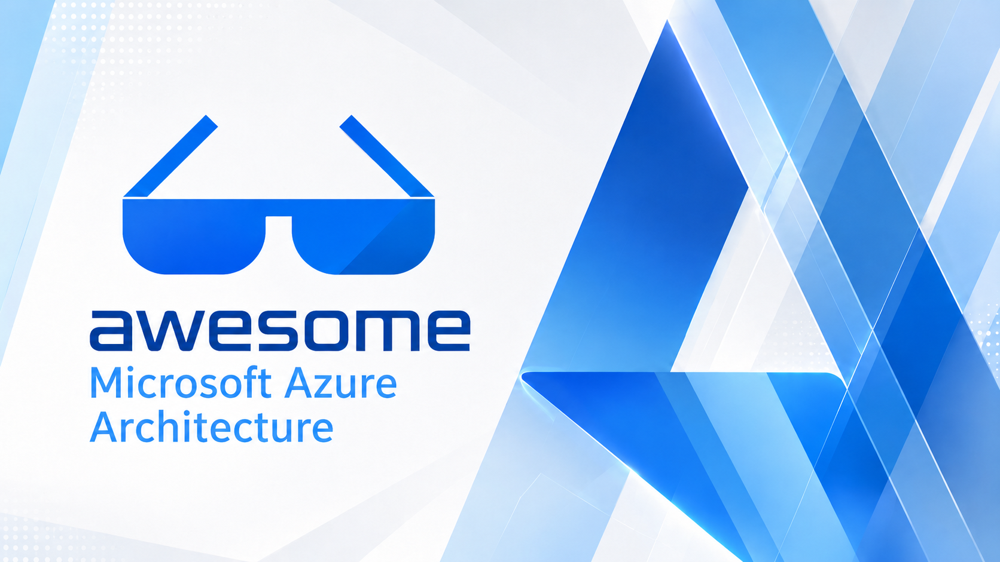

# Awesome Microsoft Azure Architecture  <!-- omit in toc -->

This is a curated list of AWESOME blogs, videos, tutorials, code, tools, and scripts related to the design and implementation of solutions in Microsoft Azure.

This list contains anything that can help with your **Microsoft Azure architecture** and quickly get you up and running when designing, planning, and implementing services that empower organizations around the planet to achieve more.

This list can be found at [aka.ms/AwesomeAzureArchitecture](https://aka.ms/AwesomeAzureArchitecture).

> Community [contributions](contributing.md) are most welcome! Feel free to submit a **pull request** with any adds/removes/changes to content!
## Contents

- [Official](#official)
  - [Official Microsoft Learn paths](#official-microsoft-learn-paths)
  - [Official Docs](#official-docs)
  - [Official Videos](#official-videos)
  - [Official Announcements and Articles](#official-announcements-and-articles)
  - [Official Books](#official-books)
  - [Official Repositories and Tools](#official-repositories-and-tools)
  - [Official Forums and Feedback](#official-forums-and-feedback)
  - [Official Meetups and Calls](#official-meetups-and-calls)
  - [Official Podcasts](#official-podcasts)
- [Community](#community)
  - [Community Videos](#community-videos)
  - [Community Podcasts](#community-podcasts)
  - [Community Books](#community-books)
  - [Community Articles](#community-articles)
  - [Community Repositories and Tools](#community-repositories-and-tools)
  - [Community Newsletter](#community-newsletter)
  - [Community Forums](#community-forums)
  - [Community Discord](#community-discord)
  - [Community Slack](#community-slack)

## Official

> Links below are from official Microsoft sources, websites, and channels.

### Official Microsoft Learn paths

Official Microsoft Learn Learning paths.

- [Administering Windows Server Hybrid Core Infrastructure](https://learn.microsoft.com/training/courses/az-800t00?WT.mc_id=AZ-MVP-5004796)
- [Microsoft Azure Administrator](https://learn.microsoft.com/training/courses/az-104t00?WT.mc_id=AZ-MVP-5004796)
- [AI Learning Hub](https://learn.microsoft.com/ai/?tabs=developer&WT.mc_id=AZ-MVP-5004796)
- [Automating Administration with PowerShell](https://learn.microsoft.com/training/courses/az-040t00?WT.mc_id=AZ-MVP-5004796)
- [AZ-700 Designing and Implementing Microsoft Azure Networking Solutions](https://learn.microsoft.com/training/paths/design-implement-microsoft-azure-networking-solutions-az-700/?WT.mc_id=AZ-MVP-5004796)
- [AZ-720: Azure Support Engineer for Connectivity Specialty](https://learn.microsoft.com/training/paths/azure-support-engineer-for-connectivity-specialty/?WT.mc_id=AZ-MVP-5004796)
- [Configuring and Operating Microsoft Azure Virtual Desktop](https://learn.microsoft.com/training/courses/az-140t00?WT.mc_id=AZ-MVP-5004796)
- [Design an enterprise governance strategy](https://learn.microsoft.com/training/modules/enterprise-governance/?WT.mc_id=AZ-MVP-5004796)
- [Designing and Implementing Platform Engineering](https://learn.microsoft.com/training/paths/designing-implementing-platform-engineering/?WT.mc_id=AZ-MVP-5004796)
- [Designing Microsoft Azure Infrastructure Solutions](https://learn.microsoft.com/en-us/training/courses/az-305t00?WT.mc_id=AZ-MVP-5004796)
- [Get started with FinOps](https://learn.microsoft.com/en-gb/training/modules/get-started-with-finops/?WT.mc_id=AZ-MVP-5004796)
- [Linux on Azure](https://learn.microsoft.com/learn/paths/azure-linux/?WT.mc_id=AZ-MVP-5004796)
- [Microsoft Azure Fundamentals](https://learn.microsoft.com/training/courses/az-900t00?WT.mc_id=AZ-MVP-5004796)
- [Microsoft Certifications](https://learn.microsoft.com/certifications/?WT.mc_id=AZ-MVP-5004796)
- [Microsoft Technical Quest](https://mtq.microsoft.com/?WT.mc_id=AZ-MVP-5004796)
- [Plans on Microsoft Learn](https://learn.microsoft.com/training/support/plans?WT.mc_id=AZ-MVP-5004796)

### Official Docs

Official Microsoft Learn, articles, blogs, and resources.

- [AI agent adoption guidance for organizations](https://learn.microsoft.com/azure/cloud-adoption-framework/ai-agents/?WT.mc_id=AZ-MVP-5004796)
- [AI agent orchestration patterns](https://learn.microsoft.com/azure/architecture/ai-ml/guide/ai-agent-design-patterns?WT.mc_id=AZ-MVP-5004796)
- [AI architecture design](https://learn.microsoft.com/azure/architecture/ai-ml/?WT.mc_id=AZ-MVP-5004796)
- [AKS baseline reference architecture](https://learn.microsoft.com/azure/architecture/reference-architectures/containers/aks/baseline-aks?WT.mc_id=AZ-MVP-5004796)
- [Architect multitenant solutions on Azure](https://learn.microsoft.com/azure/architecture/guide/multitenant/overview?WT.mc_id=AZ-MVP-5004796)
- [Automation adoption strategy](https://learn.microsoft.com/power-platform/guidance/automation-coe/strategy?WT.mc_id=AZ-MVP-5004796)
- [Azure application architecture fundamentals](https://learn.microsoft.com/azure/architecture/guide/?WT.mc_id=AZ-MVP-5004796)
- [Azure Arc](https://azure.microsoft.com/services/azure-arc/?WT.mc_id=AZ-MVP-5004796)
- [Azure Arc landing zone accelerator for hybrid and multicloud](https://learn.microsoft.com/azure/cloud-adoption-framework/scenarios/hybrid/enterprise-scale-landing-zone?WT.mc_id=AZ-MVP-5004796)
- [Azure Architecture Center](https://learn.microsoft.com/azure/architecture/?WT.mc_id=AZ-MVP-5004796)
- [Azure Architecture Icons](https://learn.microsoft.com/azure/architecture/icons/?WT.mc_id=AZ-MVP-5004796)
- [Azure Architecture reference architecture](https://learn.microsoft.com/azure/architecture/browse/?WT.mc_id=AZ-MVP-5004796)
- [Azure Bicep](https://learn.microsoft.com/azure/azure-resource-manager/bicep/?WT.mc_id=AZ-MVP-5004796)
- [Microsoft Azure Bounty Program](https://www.microsoft.com/en-us/msrc/bounty-microsoft-azure?WT.mc_id=AZ-MVP-5004796&oneroute=true)
- [Azure Chaos Studio documentation](https://learn.microsoft.com/azure/chaos-studio/?WT.mc_id=AZ-MVP-5004796)
- [Azure compliance documentation](https://learn.microsoft.com/azure/compliance/?WT.mc_id=AZ-MVP-5004796)
- [Azure confidential computing](https://azure.microsoft.com/en-us/solutions/confidential-compute/?WT.mc_id=AZ-MVP-5004796#overview)
- [Azure Container Apps workshop](https://azure.github.io/aca-dotnet-workshop/aca/00-workshop-intro/)
- [Azure Database Migration Guides](https://learn.microsoft.com/data-migration/?WT.mc_id=AZ-MVP-5004796)
- [Azure Databricks documentation](https://learn.microsoft.com/azure/databricks/?WT.mc_id=AZ-MVP-5004796)
- [Azure Developer CLI documentation](https://learn.microsoft.com/azure/developer/azure-developer-cli/?WT.mc_id=AZ-MVP-5004796)
- [Azure DevOps documentation](https://learn.microsoft.com/azure/devops/?view=azure-devops&WT.mc_id=AZ-MVP-5004796)
- [Microsoft AI Cloud Partner Program](https://learn.microsoft.com/partner-center/membership/mpn-overview?WT.mc_id=AZ-MVP-5004796)
- [Azure Governance](https://learn.microsoft.com/azure/governance/?WT.mc_id=AZ-MVP-5004796)
- [Azure landing zone design areas and conceptual architecture](https://learn.microsoft.com/azure/cloud-adoption-framework/ready/landing-zone/design-areas?WT.mc_id=AZ-MVP-5004796)
- [Azure landing zone implementation options](https://learn.microsoft.com/azure/cloud-adoption-framework/ready/landing-zone/implementation-options?WT.mc_id=AZ-MVP-5004796)
- [Azure landing zones for modern application platforms](https://learn.microsoft.com/azure/cloud-adoption-framework/scenarios/app-platform/ready?WT.mc_id=AZ-MVP-5004796)
- [Azure Lighthouse](https://learn.microsoft.com/azure/lighthouse/?WT.mc_id=AZ-MVP-5004796)
- [Azure Local baseline reference architecture](https://learn.microsoft.com/azure/architecture/hybrid/azure-local-baseline?WT.mc_id=AZ-MVP-5004796)
- [Azure MCP Server documentation](https://learn.microsoft.com/azure/developer/azure-mcp-server/?WT.mc_id=AZ-MVP-5004796)
- [Azure Migrate](https://azure.microsoft.com/en-us/services/azure-migrate/?WT.mc_id=AZ-MVP-5004796)
- [Azure Migration Tool Comparison Matrix](https://aka.ms/comparemigrationtools?WT.mc_id=AZ-MVP-5004796)
- [Azure Patterns and Practices contributions](https://learn.microsoft.com/contribute/content/architecture-center/aac-contribute?WT.mc_id=AZ-MVP-5004796)
- [Azure Proactive Resiliency Library (APRL)](https://azure.github.io/Azure-Proactive-Resiliency-Library-v2/welcome/)
- [Azure products](https://azure.microsoft.com/en-us/products?WT.mc_id=AZ-MVP-5004796)
- [Azure reliability documentation](https://learn.microsoft.com/azure/reliability/overview?WT.mc_id=AZ-MVP-5004796)
- [Azure Resource Graph documentation](https://learn.microsoft.com/azure/governance/resource-graph/?WT.mc_id=AZ-MVP-5004796)
- [Azure security baseline for Azure Virtual Desktop](https://learn.microsoft.com/security/benchmark/azure/baselines/virtual-desktop-security-baseline?WT.mc_id=AZ-MVP-5004796)
- [Azure security best practices](https://learn.microsoft.com/en-gb/azure/cloud-adoption-framework/secure/security-top-10?WT.mc_id=AZ-MVP-5004796)
- [Azure security best practices and patterns](https://learn.microsoft.com/azure/security/fundamentals/best-practices-and-patterns?WT.mc_id=AZ-MVP-5004796)
- [Azure security documentation](https://learn.microsoft.com/azure/security/?WT.mc_id=AZ-MVP-5004796)
- [Azure serverless overview: Create cloud-based apps and solutions with Azure Logic Apps and Azure Functions](https://learn.microsoft.com/azure/logic-apps/logic-apps-serverless-overview?WT.mc_id=AZ-MVP-5004796)
- [Azure Service Health documentation](https://learn.microsoft.com/azure/service-health/?WT.mc_id=AZ-MVP-5004796)
- [Azure Service-level agreements](https://azure.microsoft.com/en-us/support/legal/sla/?WT.mc_id=AZ-MVP-5004796)
- [Azure SRE Agent documentation](https://sre.azure.com/docs/overview)
- [Microsoft Azure Support](https://azure.microsoft.com/en-us/support/options/?WT.mc_id=AZ-MVP-5004796)
- [Azure sustainability](https://azure.microsoft.com/en-gb/global-infrastructure/sustainability/?WT.mc_id=AZ-MVP-5004796)
- [Azure Table storage design](https://learn.microsoft.com/azure/storage/tables/table-storage-design?WT.mc_id=AZ-MVP-5004796)
- [Azure VMware Solution](https://azure.microsoft.com/en-us/services/azure-vmware/?WT.mc_id=AZ-MVP-5004796)
- [Azure VMware Solution landing zone accelerator](https://learn.microsoft.com/azure/cloud-adoption-framework/scenarios/azure-vmware/enterprise-scale-landing-zone?WT.mc_id=AZ-MVP-5004796)
- [Microsoft Azure Well-Architected Framework](https://learn.microsoft.com/azure/architecture/framework/?WT.mc_id=AZ-MVP-5004796)
- [Microsoft Azure Well-Architected Framework pillars](https://learn.microsoft.com/azure/well-architected/pillars?WT.mc_id=AZ-MVP-5004796)
- [Azure Well-Architected Framework service guides](https://learn.microsoft.com/azure/well-architected/service-guides/?WT.mc_id=AZ-MVP-5004796)
- [Baseline Microsoft Foundry chat reference architecture](https://learn.microsoft.com/azure/architecture/ai-ml/architecture/baseline-microsoft-foundry-chat?WT.mc_id=AZ-MVP-5004796)
- [Best practices in cloud applications](https://learn.microsoft.com/azure/architecture/best-practices/index-best-practices?WT.mc_id=AZ-MVP-5004796)
- [Choose a Microsoft Fabric deployment pattern](https://learn.microsoft.com/azure/architecture/data-guide/technology-choices/fabric-deployment-patterns?WT.mc_id=AZ-MVP-5004796)
- [Choose the right integration and automation services in Azure](https://learn.microsoft.com/azure/azure-functions/functions-compare-logic-apps-ms-flow-webjobs?WT.mc_id=AZ-MVP-5004796)
- [Cloud Design Patterns](https://learn.microsoft.com/azure/architecture/patterns/?WT.mc_id=AZ-MVP-5004796)
- [Cloud design patterns that support security](https://learn.microsoft.com/azure/well-architected/security/design-patterns?WT.mc_id=AZ-MVP-5004796)
- [Cloud economics](https://azure.microsoft.com/solutions/cloud-economics/?WT.mc_id=AZ-MVP-5004796#overview)
- [Cloud Services Due Diligence Checklist](https://www.microsoft.com/en-nz/trust-center/compliance/due-diligence-checklist?WT.mc_id=AZ-MVP-5004796)
- [Compute decision tree](https://learn.microsoft.com/azure/architecture/guide/technology-choices/compute-decision-tree?WT.mc_id=AZ-MVP-5004796)
- [Create an Azure support ticket](https://azure.microsoft.com/en-us/support/create-ticket/?WT.mc_id=AZ-MVP-5004796)
- [Define your Azure resource naming convention](https://learn.microsoft.com/azure/cloud-adoption-framework/ready/azure-best-practices/resource-naming?WT.mc_id=AZ-MVP-5004796)
- [Deploy Azure landing zones](https://learn.microsoft.com/azure/architecture/landing-zones/landing-zone-deploy?WT.mc_id=AZ-MVP-5004796)
- [Enterprise web app patterns](https://learn.microsoft.com/azure/architecture/web-apps/guides/enterprise-app-patterns/overview?WT.mc_id=AZ-MVP-5004796)
- [Generative AI Operations for organizations with MLOps investments](https://learn.microsoft.com/azure/architecture/ai-ml/guide/genaiops-for-mlops?WT.mc_id=AZ-MVP-5004796)
- [Microservices architecture style](https://learn.microsoft.com/azure/architecture/guide/architecture-styles/microservices?WT.mc_id=AZ-MVP-5004796)
- [Microsoft Cloud Adoption Framework for Azure](https://learn.microsoft.com/azure/cloud-adoption-framework/?WT.mc_id=AZ-MVP-5004796)
- [Microsoft Cost Management documentation](https://learn.microsoft.com/azure/cost-management-billing/costs/?WT.mc_id=AZ-MVP-5004796)
- [Microsoft Defender for Cloud](https://learn.microsoft.com/azure/defender-for-cloud/defender-for-cloud-introduction?WT.mc_id=AZ-MVP-5004796)
- [Microsoft Digital Defense Report](https://www.microsoft.com/en-us/security/business/microsoft-digital-defense-report?WT.mc_id=AZ-MVP-5004796)
- [Microsoft Foundry documentation](https://learn.microsoft.com/azure/ai-foundry/?WT.mc_id=AZ-MVP-5004796)
- [Microsoft Foundry landing zone reference architecture](https://learn.microsoft.com/azure/architecture/ai-ml/architecture/baseline-microsoft-foundry-landing-zone?WT.mc_id=AZ-MVP-5004796)
- [Microsoft Investor Relations](https://www.microsoft.com/en-us/investor?WT.mc_id=AZ-MVP-5004796)
- [Microsoft Learn MCP Server](https://learn.microsoft.com/training/support/mcp?WT.mc_id=AZ-MVP-5004796)
- [Microsoft Learning Rooms](https://aka.ms/learningrooms?WT.mc_id=AZ-MVP-5004796)
- [Microsoft Partner Center](https://learn.microsoft.com/partner-center/enroll/overview?WT.mc_id=AZ-MVP-5004796)
- [Microsoft Product/Licensing Terms](https://www.microsoft.com/licensing/terms/welcome/welcomepage?WT.mc_id=AZ-MVP-5004796)
- [Microsoft Trust Center](https://www.microsoft.com/en-us/trust-center?WT.mc_id=AZ-MVP-5004796)
- [Mission-critical baseline architecture on Azure](https://learn.microsoft.com/azure/architecture/reference-architectures/containers/aks-mission-critical/mission-critical-intro?WT.mc_id=AZ-MVP-5004796)
- [Pattern implementation for network secure ingress](https://learn.microsoft.com/azure/architecture/pattern-implementations/network-secure-ingress?WT.mc_id=AZ-MVP-5004796)
- [Prepare to choose a data store in Azure](https://learn.microsoft.com/azure/architecture/guide/technology-choices/data-stores-getting-started?WT.mc_id=AZ-MVP-5004796)
- [Recommendations for establishing a security baseline](https://learn.microsoft.com/azure/well-architected/security/establish-baseline?WT.mc_id=AZ-MVP-5004796)
- [Recommendations for fostering DevOps culture](https://learn.microsoft.com/azure/well-architected/operational-excellence/devops-culture?WT.mc_id=AZ-MVP-5004796)
- [Recommendations for securing a development lifecycle](https://learn.microsoft.com/azure/well-architected/security/secure-development-lifecycle?WT.mc_id=AZ-MVP-5004796)
- [Reliability design checklist](https://learn.microsoft.com/azure/well-architected/reliability/checklist?WT.mc_id=AZ-MVP-5004796)
- [Responsible AI dashboard in Azure Machine Learning](https://learn.microsoft.com/azure/machine-learning/concept-responsible-ai-dashboard?WT.mc_id=AZ-MVP-5004796)
- [Security baselines for Azure overview](https://learn.microsoft.com/security/benchmark/azure/security-baselines-overview?WT.mc_id=AZ-MVP-5004796)
- [Security design principles](https://learn.microsoft.com/azure/well-architected/security/security-principles?WT.mc_id=AZ-MVP-5004796)
- [Serverless design examples](https://learn.microsoft.com/dotnet/architecture/serverless/serverless-design-examples?WT.mc_id=AZ-MVP-5004796)
- [Subscription decision guide](https://learn.microsoft.com/azure/cloud-adoption-framework/decision-guides/subscriptions/?WT.mc_id=AZ-MVP-5004796)
- [Ten design principles for Azure applications](https://learn.microsoft.com/azure/architecture/guide/design-principles/?WT.mc_id=AZ-MVP-5004796)
- [Virtual Microsoft Datacenter Tour](https://news.microsoft.com/stories/microsoft-datacenter-tour/?WT.mc_id=AZ-MVP-5004796)
- [Visual Studio subscriptions](https://azure.microsoft.com/en-us/services/developer-tools/visual-studio-subscriptions/?WT.mc_id=AZ-MVP-5004796)
- [What is an Azure landing zone?](https://learn.microsoft.com/azure/cloud-adoption-framework/ready/landing-zone/?WT.mc_id=AZ-MVP-5004796)
- [What is Microsoft Entra ID B2C?](https://learn.microsoft.com/azure/active-directory-b2c/overview?WT.mc_id=AZ-MVP-5004796)
- [What is platform engineering?](https://learn.microsoft.com/platform-engineering/what-is-platform-engineering?WT.mc_id=AZ-MVP-5004796)
- [What is the Azure Well-Architected Framework?](https://learn.microsoft.com/azure/well-architected/what-is-well-architected-framework?WT.mc_id=AZ-MVP-5004796)

### Official Videos

Official Microsoft videos.

- [AI Show](https://learn.microsoft.com/shows/ai-show/?WT.mc_id=AZ-MVP-5004796)
- [Ask The Expert](https://learn.microsoft.com/shows/ask-the-expert/?WT.mc_id=AZ-MVP-5004796)
- [Microsoft Events](https://www.microsoft.com/en-us/events?WT.mc_id=AZ-MVP-5004796)
- [Azure Developers](https://learn.microsoft.com/shows/azure-developers/?WT.mc_id=AZ-MVP-5004796)
- [Azure Essentials Show](https://learn.microsoft.com/shows/azure-essentials-show/?WT.mc_id=AZ-MVP-5004796)
- [Exam Readiness Zone](https://learn.microsoft.com/shows/exam-readiness-zone/?WT.mc_id=AZ-MVP-5004796)
- [Azure Friday](https://learn.microsoft.com/shows/azure-friday/?WT.mc_id=AZ-MVP-5004796)
- [Gov Chat: Cloud Conversations](https://learn.microsoft.com/shows/govchat/?WT.mc_id=AZ-MVP-5004796)
- [Inside Azure Datacenter Architecture with Mark Russinovich (Ignite 2020)](https://www.youtube.com/playlist?list=PLhFhDWFYccZ-9GrxlbQ50dyMnIc1lCxZE)
- [Inside Azure for IT](https://learn.microsoft.com/shows/inside-azure-for-it/?WT.mc_id=AZ-MVP-5004796)
- [Internet of Things Show](https://learn.microsoft.com/shows/internet-of-things-show/?WT.mc_id=AZ-MVP-5004796)
- [Learn Live](https://learn.microsoft.com/shows/learn-live/?WT.mc_id=AZ-MVP-5004796)
- [Make Azure AI Real](https://learn.microsoft.com/shows/make-azure-ai-real/?WT.mc_id=AZ-MVP-5004796)
- [Open at Microsoft](https://learn.microsoft.com/shows/open-at-microsoft/?WT.mc_id=AZ-MVP-5004796)
- [Reactor](https://learn.microsoft.com/shows/reactor/?WT.mc_id=AZ-MVP-5004796)
- [Sip and Sync with Azure](https://learn.microsoft.com/shows/sip-and-sync-with-azure/?WT.mc_id=AZ-MVP-5004796)
- [The DevOps Lab](https://learn.microsoft.com/shows/devops-lab/?WT.mc_id=AZ-MVP-5004796)

### Official Announcements and Articles

Official Microsoft feature and product announcement pages and what's new.

- [Azure Architecture Blog](https://techcommunity.microsoft.com/category/azure/blog/azurearchitectureblog?WT.mc_id=AZ-MVP-5004796)
- [Azure on X](https://twitter.com/Azure)
- [Azure Updates](https://azure.microsoft.com/updates?WT.mc_id=AZ-MVP-5004796)
- [What's new in the Microsoft Cloud Adoption Framework for Azure](https://learn.microsoft.com/azure/cloud-adoption-framework/get-started/whats-new?WT.mc_id=AZ-MVP-5004796)
- [What's new in the Azure Well-Architected Framework](https://learn.microsoft.com/azure/well-architected/whats-new?WT.mc_id=AZ-MVP-5004796)

### Official Books

Official Microsoft ebooks and whitepapers.

- [Analyst reports, e-books, and white papers](https://azure.microsoft.com/resources/research/?WT.mc_id=AZ-MVP-5004796)
- [ASP.NET Core architecture e-book](https://dotnet.microsoft.com/en-us/download/e-book/aspnet/pdf?WT.mc_id=AZ-MVP-5004796)
- [Migration Linux to Microsoft Azure](https://info.microsoft.com/ww-landing-migrating-linux-to-microsoft-azure.html?WT.mc_id=AZ-MVP-5004796)
- [New Zealand Cloud Region Customer Playbook](https://aka.ms/nzcloudregionplaybook?WT.mc_id=AZ-MVP-5004796)
- [New Zealand Cloud Region Partner Playbook](https://aka.ms/nzplaybook?WT.mc_id=AZ-MVP-5004796)
- [The Developer's Guide to Azure](https://azure.microsoft.com/en-us/resources/whitepapers/developer-guide-to-azure/?WT.mc_id=AZ-MVP-5004796)

### Official Repositories and Tools

Official Microsoft open-source initiatives and repositories.

- [AI Gateway](https://azure-samples.github.io/AI-Gateway/)
- [AKS Baseline reference implementation](https://github.com/mspnp/aks-baseline)
- [AKS Landing Zone Accelerator](https://github.com/Azure/AKS-Landing-Zone-Accelerator)
- [Alert Toolkit](https://github.com/microsoft/manageability-toolkits)
- [ALZ Bicep](https://github.com/Azure/ALZ-Bicep)
- [ALZ-PowerShell-Module](https://github.com/Azure/ALZ-PowerShell-Module)
- [APIM(Azure API Management)Love](https://aka.ms/apimlove)
- [App Service Landing Zone Accelerator](https://github.com/Azure/appservice-landing-zone-accelerator)
- [ARO (Azure Red Hat OpenShift) Landing Zone Accelerator](https://github.com/Azure/aro-Landing-Zone-Accelerator)
- [ASTEROID Project (BETA)](https://azure.github.io/Asteroid/)
- [AVDAccelerator](https://github.com/Azure/avdaccelerator)
- [Awesome Azure Developer CLI](https://azure.github.io/awesome-azd/)
- [Azure Accelerators](https://msusazureaccelerators.github.io/)
- [Azure Arc Jumpstart](https://azurearcjumpstart.io/)
- [Azure Backup Detailed Estimate](https://aka.ms/AzureBackupDetailedEstimates?WT.mc_id=AZ-MVP-5004796)
- [Azure Certification Poster](https://aka.ms/traincertposter/?WT.mc_id=AZ-MVP-5004796)
- [Azure Connectivity Toolkit (AzureCT)](https://github.com/Azure/NetworkMonitoring/tree/main/AzureCT)
- [Azure DevOps Marketplace](https://marketplace.visualstudio.com/azuredevops/?WT.mc_id=AZ-MVP-5004796)
- [Azure Hybrid Use Benefit Calculator](https://azure.microsoft.com/en-us/pricing/hybrid-benefit/?WT.mc_id=AZ-MVP-5004796#calculator)
- [Azure IPAM](https://azure.github.io/ipam/#/)
- [Azure Landing Zones for Canadian Public Sector](https://github.com/Azure/CanadaPubSecALZ)
- [Azure Landing Zones Library Documentation](https://azure.github.io/Azure-Landing-Zones-Library/)
- [Azure Landing Zones Terraform AVM pattern module](https://github.com/Azure/terraform-azurerm-avm-ptn-alz)
- [Azure Landing Zones Terraform documentation](https://azure.github.io/Azure-Landing-Zones/terraform/)
- [Azure Monitor Baseline Alerts](https://azure.github.io/azure-monitor-baseline-alerts/)
- [Azure Naming Tool](https://github.com/mspnp/AzureNamingTool)
- [Azure Network Security](https://github.com/Azure/Azure-Network-Security)
- [Azure Pricing Calculator](https://azure.microsoft.com/en-us/pricing/calculator/?WT.mc_id=AZ-MVP-5004796)
- [Azure Quick Review](https://github.com/Azure/azqr)
- [Azure Quickstart Templates](https://github.com/Azure/azure-quickstart-templates)
- [Azure Resource Explorer](https://resources.azure.com/)
- [Azure Resource Inventory](https://github.com/microsoft/ARI)
- [Azure Review Checklists](https://github.com/Azure/review-checklists)
- [Azure Site Recovery Deployment Planner](https://learn.microsoft.com/azure/site-recovery/site-recovery-deployment-planner/?WT.mc_id=AZ-MVP-5004796)
- [Azure Sovereign Landing Zone (SLZ)](https://learn.microsoft.com/industry/sovereignty/slz-overview?WT.mc_id=AZ-MVP-5004796)
- [Azure Status](https://azure.status.microsoft/?WT.mc_id=AZ-MVP-5004796)
- [Azure Storage Explorer](https://azure.microsoft.com/en-us/features/storage-explorer/?WT.mc_id=AZ-MVP-5004796)
- [Azure Threat Research Matrix](https://microsoft.github.io/Azure-Threat-Research-Matrix/)
- [Azure TRE](https://microsoft.github.io/AzureTRE/latest/)
- [Azure Verified Modules](https://aka.ms/AVM)
- [Azure Well-Architected Review](https://learn.microsoft.com/assessments/azure-architecture-review/?WT.mc_id=AZ-MVP-5004796)
- [Bicep subscription vending](https://github.com/Azure/bicep-lz-vending)
- [Business Continuity Guide](https://techcommunity.microsoft.com/t5/fasttrack-for-azure/introducing-the-azure-business-continuity-guide/ba-p/3905424?WT.mc_id=AZ-MVP-5004796)
- [Cloud Adoption Framework repository](https://github.com/MicrosoftDocs/cloud-adoption-framework)
- [Cloud Roles and Operations Management](https://github.com/Azure/cloud-rolesandops)
- [Continuous Cloud Optimization Insights](https://github.com/Azure/CCOInsights)
- [FinOps hubs](https://microsoft.github.io/finops-toolkit/hubs)
- [Data Management & Analytics Scenario - Data Landing Zone](https://github.com/Azure/data-landing-zone)
- [DevOps Tooling for Well-Architected Recommendation Process](https://github.com/Azure/WellArchitected-Tools/tree/main/WARP/devops#readme)
- [Enterprise-Scale - Reference Implementation](https://github.com/Azure/Enterprise-Scale)
- [FinOps Toolkit](https://microsoft.github.io/finops-toolkit/)
- [Microsoft Applied Skills Poster](https://aka.ms/appliedskillsposter?sharingId=MVP_473698)
- [Microsoft Assessments](https://learn.microsoft.com/assessments/?WT.mc_id=AZ-MVP-5004796)
- [Microsoft Datacenter Migration Program Kit (DCM Kit)](https://github.com/microsoft/dcmkit)
- [Microsoft Defender for Cloud](https://github.com/Azure/Microsoft-Defender-for-Cloud)
- [Microsoft Exam Simulator](https://aka.ms/examdemo/?WT.mc_id=AZ-MVP-5004796)
- [Microsoft Kusto Detective Agency](https://detective.kusto.io/)
- [View and analyze Azure emissions data](https://learn.microsoft.com/azure/carbon-optimization/view-emissions?WT.mc_id=AZ-MVP-5004796)
- [Mission LZ (Landing Zone)](https://github.com/Azure/missionlz)
- [MSLab](https://github.com/microsoft/MSLab)
- [PSRule for Azure](https://github.com/Azure/PSRule.Rules.Azure)
- [Solution Architecture Questions](https://github.com/Azure/Solution-Architecture-Questions)
- [Static Web Apps CLI](https://azure.github.io/static-web-apps-cli/)
- [Synapse Machine Learning](https://github.com/microsoft/SynapseML)
- [The Migration Guide](https://github.com/Azure/migration)
- [What The Hack](https://aka.ms/wth)

### Official Forums and Feedback

Official Microsoft product feedback sources.

- [Microsoft Azure - General Feedback](https://feedback.azure.com/d365community/?WT.mc_id=AZ-MVP-5004796)
- [Azure Connection Program (ACP)](https://aka.ms/ACPNomination)
- [Microsoft Q&A](https://learn.microsoft.com/answers/index.html?WT.mc_id=AZ-MVP-5004796)
- [Tech Community - Azure](https://techcommunity.microsoft.com/t5/azure/ct-p/Azure?WT.mc_id=AZ-MVP-5004796)

### Official Meetups and Calls

Microsoft delivered community engagement meetings.

- [Adaptive Cloud Community](https://github.com/microsoft/adaptive_cloud_community)
- [Azure ARM/Bicep Community Calls](https://github.com/Azure/bicep/issues?q=label%3A%22Community+Call%22+)
- [Cloud Security](https://techcommunity.microsoft.com/t5/security-compliance-and-identity/join-our-security-community/ba-p/927888?WT.mc_id=AZ-MVP-5004796)
- [Azure Development Community Call](https://github.com/Azure/azure-dev/discussions/categories/announcements)
- [Azure DSC Community Call](https://dsccommunity.org/community_calls/)
- [Azure Kubernetes Service (AKS) Community](https://github.com/theakscommunity/aks-community-meetings)
- [Azure Landing Zone Community Calls](https://aka.ms/ALZ/CommunityCallAgenda)
- [M365 Platform Community](https://pnp.github.io/#community)
- [Microsoft Management Customer Connection Program](https://techcommunity.microsoft.com/blog/microsoftendpointmanagerblog/announcing-the-microsoft-management-customer-connection-program/3725035?WT.mc_id=AZ-MVP-5004796)
- [PowerShell](https://github.com/PowerShell/PowerShell-RFC/tree/master/CommunityCall)
- [Radius Community Meetings](https://github.com/radius-project/community#community-meetings)
- [Microsoft Reactor](https://developer.microsoft.com/en-us/reactor/?WT.mc_id=AZ-MVP-5004796)
- [Semantic Kernel Community Calls](https://github.com/microsoft/semantic-kernel/blob/main/COMMUNITY.md)
- [Azure Static WebApps - Community Livestream](https://aka.ms/swa/community/standups)
- [Azure Tech Groups](https://www.meetup.com/pro/azuretechgroups)
- [Terraform](https://aka.ms/AzureTerraform)

### Official Podcasts

Official Microsoft podcasts.

- [Behind the Tech with Kevin Scott](https://www.microsoft.com/en-us/behind-the-tech?WT.mc_id=AZ-MVP-5004796)
- [Microsoft Cloud Executive Enablement Series](https://shows.acast.com/microsoft-cloud-executive-enablement-series)
- [Hybrid Cloud Partners](https://news.microsoft.com/podcasts/hybrid-cloud-partners?WT.mc_id=AZ-MVP-5004796)
- [Microsoft Research Podcast](https://www.microsoft.com/en-us/research/podcast?WT.mc_id=AZ-MVP-5004796)
- [Scott & Mark Learn To](https://shows.acast.com/scott-and-mark-learn-to)
- [The Future of Infrastructure](https://wwps.microsoft.com/blog/future-of-infrastructure-podcast-series-welcome?WT.mc_id=AZ-MVP-5004796)

## Community

> Links below are from community sources, websites, and channels.

### Community Videos

Community videos.

- [Cloud Design Patterns - Luke Murray](https://youtu.be/nnuo_mxPcNw)
- [Azure explained in plain English videos - Cloud Monk](https://www.youtube.com/playlist?list=PLp_fsLj4v7gSDKJbODbdvjOtDx3-35ae6)
- [Fireside Chat with Luke Murray](https://www.youtube.com/playlist?list=PLFZkd0-5eeIi4QOaD610vD1U0MFeaZMy_)
- [Microsoft Learning Room - Azure Cloud Commanders (Luke Murray)](https://www.youtube.com/playlist?list=PLFZkd0-5eeIjtxiV12_V2ZH7VR44z8aJQ)
- [Microsoft Azure Master Class v2 - John Savill](https://www.youtube.com/watch?v=BlSVX1WqTXk&t=0s)
- [Regain Control with Azure Governance - Sam Cogan](https://www.youtube.com/watch?v=M2y0QsHLeSs)

### Community Podcasts

Community podcasts.

- [Azure & DevOps Podcast](https://open.spotify.com/show/4TDNfvJ6uuWiYxT8nvpddG?si=331542af0902437a)
- [Ctrl+Alt+Azure](https://ctrlaltazure.com/)
- [Azure Podcast](https://www.azpodcast.com/)
- [Sarah Leans Podcast](https://open.spotify.com/show/34QAAvMLSYN09eOAu3j2b0)

### Community Books

Community books, both physical and ebooks.

- [Azure Architecture Explained](https://www.packtpub.com/product/azure-architecture-explained/9781837634811)
- [Cloud Observability with Azure Monitor](https://www.packtpub.com/en-us/product/cloud-observability-with-azure-monitor-9781835881194)
- [Cloud Solution Architect's Career Master Plan: Proven techniques and effective tips to help you become a successful solution architect](https://www.amazon.com/Cloud-Solution-Architects-Career-Master/dp/1805129716)
- [Azure Cookbook](https://bpbonline.com/products/azure-cookbook-1)
- [Azure Security](https://www.manning.com/books/azure-security-2)

### Community Articles

Community blogs and articles.

- [Azure - Considerations for Dev/Test "Sandboxes"](https://github.com/dazzlejim/AzureSandbox)
- [Microsoft Azure - Wikipedia](https://en.wikipedia.org/wiki/Microsoft_Azure)
- [Architecture in the Cloud](https://luke.geek.nz/azure/architecture-in-the-cloud/)
- [Azure AI Landing Zone: The 2026 Reference Architecture](https://az365.ai/blog/azure-ai-landing-zone-reference-architecture-2026/)
- [Azure Citadel](https://azurecitadel.com/)
- [Cloud Design Patterns](https://luke.geek.nz/azure/cloud-design-patterns/)
- [Deploy Azure Naming Tool into an Azure WebApp as a container](https://luke.geek.nz/azure/deploy-azure-naming-tool-into-an-azure-webapp-as-a-container/)
- [How to write a design document for Azure](https://www.cloudelicious.net/how-to-write-a-design-document-for-azure/)
- [Luke Murray's Azure Blog](https://luke.geek.nz/)
- [Microsoft Azure Naming Conventions](https://luke.geek.nz/azure/microsoft-azure-naming-conventions/)
- [Study Guide for Azure Architect exam AZ-305: Part 1 - Design a Governance Solution](https://thecloudmarathoner.com/index.php/2022/02/11/study-guide-for-az-305-designing-microsoft-azure-infrastructure-solutions-part-1-design-a-governance-solution/)
- [Study Guide for Azure Architect exam AZ-305: Part 2 - Design Authentication and Authorization Solutions](https://thecloudmarathoner.com/index.php/2022/02/12/study-guide-for-az-305-part-2-design-authentication-and-authorization-solutions/)
- [Microsoft Azure Tagging Conventions](https://luke.geek.nz/azure/microsoft-azure-tagging-conventions/)

### Community Repositories and Tools

Community-created tools and repositories.

- [Microsoft Azure - Center for Internet Security](https://www.cisecurity.org/benchmark/azure/)
- [Azure Architecture](https://github.com/lukemurraynz/Azure-Architecture)
- [Azure Architecture - Solution Requirement Consideration Checklist](https://luke.geek.nz/azure/azure-architecture-solution-requirement-consideration-checklist/)
- [Awesome Azure Local](https://github.com/schmittnieto/awesome-azure-local)
- [Awesome Azure Virtual Desktop](https://github.com/schmittnieto/awesome-azure-virtual-desktop)
- [AzADServicePrincipalInsights](https://aka.ms/AzADServicePrincipalInsights)
- [AzAdvertizer](https://www.azadvertizer.net/)
- [AzFeeds](https://azurefeeds.com/)
- [AzGovViz](https://github.com/JulianHayward/Azure-MG-Sub-Governance-Reporting)
- [AzTools](https://az.nitor.app/)
- [Azure Charts](https://azurecharts.com/)
- [Cloud Custodian](https://cloudcustodian.io/)
- [Cloud Native Architecture Mapbook](https://github.com/PacktPublishing/The-Azure-Cloud-Native-Architecture-Mapbook)
- [Cloud Net Draw](https://www.cloudnetdraw.com/)
- [CloudPrice](https://cloudprice.net/)
- [cmd.ms - the Microsoft Cloud command line](https://cmd.ms/)
- [Azure Composite SLA Estimator](https://slaestimator.aztoso.com/)
- [DevBox Accelerator](https://evilazaro.github.io/DevExp-DevBox/)
- [Azure Digital Natives Checklist](https://azdnguide.com/)
- [EntraOps](https://github.com/Cloud-Architekt/EntraOps)
- [GitHub Enterprise Server Backup On Azure](https://github.com/humanascode/GitHub-Enterprise-Server-Backup-Azure)
- [Azure Governance Made Simple](https://book.azgovernance.com/)
- [Azure IP Ranges](https://azureipranges.azurewebsites.net/)
- [Azure Key Vault Explorer](https://github.com/cricketthomas/AzureKeyVaultExplorer)
- [Azure Local Hands-on-lab guides](https://github.com/DellGEOS/AzureStackHOLs)
- [Must Learn KQL - the series, the book, the merch store](https://github.com/rod-trent/MustLearnKQL)
- [AzureNamer - CAF compliant Azure resource name generator](https://azurenamingconventions.com/)
- [Azure Network Latency Dashboard](https://latency.azure.cloud63.fr/)
- [Azure permissions reference](https://azure.permissions.cloud/)
- [Microsoft Portals](https://msportals.io/)
- [Public Cloud Comparison](https://comparecloud.in/)
- [Azure Serverless Community Library](https://github.com/Azure/ServerlessLibrary)
- [Service Bus Explorer](https://github.com/paolosalvatori/ServiceBusExplorer)
- [Azure Services Periodic Table](https://azureperiodic.data3.com/)
- [Azure Speed](https://www.azurespeed.com/Azure/Latency)
- [Azure Tenant Security Solution (AzTS)](https://github.com/azsk/AzTS-docs)
- [Terraform](https://www.terraform.io/)
- [The Azure Kubernetes Service Checklist](https://github.com/lgmorand/the-aks-checklist)
- [Topaz - Local Azure environment emulation for development](https://github.com/TheCloudTheory/Topaz)
- [Traffic Flow in Common Azure Networking Patterns](https://github.com/mattfeltonma/azure-networking-patterns)
- [Azure Virtual Network Capacity Planner](https://github.com/chunliu/vnet-capacity-planner)
- [What Broke Today](https://whatbroke.today) - AI-powered outage aggregator tracking 100+ cloud services (including Azure) with real-time Telegram alerts.

### Community Newsletter

Community-delivered newsletters.

- [AzureFeeds Newsletter](https://newsletter.azurefeeds.com/join)
- [Entra.News](https://entra.news/)

### Community Forums

Community-delivered and supported forums.

- [Reddit - Azure](https://www.reddit.com/r/AZURE/)
- [Stack Overflow - Azure](https://stackoverflow.com/questions/tagged/azure)

### Community Discord

Community delivered and supported Discord.

- [Microsoft Community](https://discord.gg/microsoft)
- [ITOpsTalk's server](https://aka.ms/itopstalk-discord)
- [PowerShell](https://discord.gg/powershell)
- [Reddit - Azure](https://discord.gg/cMxFErsEDB)

### Community Slack

Community delivered and supported Slack.

- [Ask an Azure Architect](https://askazure.io/)
- [Kubernetes Community Slack - #kubernetes-azure channel](https://slack.k8s.io/)
